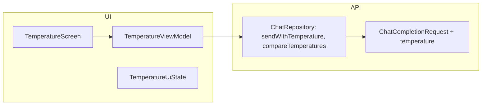

# План: работа с температурой

## Цель

Выполнять один и тот же запрос с разной температурой (0–2, шаг 0.1 — ползунок и пресеты 0, 0.7, 1.2); накапливать ответы в списке запусков; сравнивать по точности, креативности и разнообразию при наличии не менее двух ответов. Результат: примеры ответов и выводы в приложении.

## Текущее состояние

- **Temperature в API не используется.** В [OpenAiDto.kt](../app/src/main/java/com/example/aiadventchallenge/data/openai/OpenAiDto.kt) в `ChatCompletionRequest` есть только `model`, `messages`, `max_completion_tokens`, `stop`. В [ChatRepository.kt](../app/src/main/java/com/example/aiadventchallenge/data/ChatRepository.kt) запрос собирается без `temperature`.
- Паттерн «несколько запусков + сравнение» уже реализован на экране **Discussion** (4 способа рассуждения, «Запустить все», «Сравнить»). Экран «Температура» логично сделать по той же схеме: один промпт, варианты по temperature, список ответов, кнопка «Сравнить».

## Архитектура решения

- **Data:** добавить `temperature` в DTO и в методы репозитория; ввести метод сравнения списка ответов по точности/креативности/разнообразию и рекомендациям.
- **UI:** новый экран «Температура», отдельный ViewModel и UiState (по правилу: state-хелперы не в репозитории, отдельные файлы от ViewModel).

## Шаги реализации

### 1. API: параметр temperature

- **[OpenAiDto.kt](../app/src/main/java/com/example/aiadventchallenge/data/openai/OpenAiDto.kt)**  
  В `ChatCompletionRequest` добавить опциональное поле `temperature: Float? = null` (OpenAI: 0–2; при `null` используется дефолт API).
- **[ChatRepository.kt](../app/src/main/java/com/example/aiadventchallenge/data/ChatRepository.kt)**  
  - В `sendWithMessages` добавить параметр `temperature: Float? = null` и пробрасывать его в `ChatCompletionRequest`.  
  - Добавить публичный метод `sendWithTemperature(prompt: String, temperature: Float): Result<ChatResponse>`, вызывающий `sendWithMessages` с одним user-сообщением, заданным `temperature` и **без лимита токенов** (`maxTokens = null`, `stopPhrases = null` или по необходимости).  
  - Добавить метод `compareTemperatureResponses(prompt: String, runs: List<Pair<Float, String>>): Result<ChatResponse>`: один запрос к модели с текстом промпта и списком ответов (каждый с указанием temperature); инструкция — сравнить по точности, креативности, разнообразию и сформулировать, для каких задач лучше подходит каждая настройка. Вызывается при количестве запусков ≥ 2.

### 2. Модель экрана: константы и диапазон

- **Диапазон температуры (OpenAI):** 0–2, шаг 0.1 — для ползунка. Константы в `domain/` (например `TemperaturePreset.kt`): `MIN_TEMP = 0f`, `MAX_TEMP = 2f`, `TEMP_STEP = 0.1f`; пресеты для быстрых кнопок: 0, 0.7, 1.2 с подписями «Название (значение)» — «Точность (0)», «Баланс (0.7)», «Креативность (1.2)».

### 3. UI: экран «Температура»

- **Маршрут:** `temperature`. В [MainActivity.kt](../app/src/main/java/com/example/aiadventchallenge/MainActivity.kt) добавить `composable("temperature")` с `TemperatureScreen(..., onBack = { popBackStack() })`.  
- **Навигация с главного экрана:** в [HomeNav.kt](../app/src/main/java/com/example/aiadventchallenge/ui/home/HomeNav.kt) в **существующую секцию «Промптинг»** добавить пункт «Температура» → `temperature` (Чат, Обсуждение, Температура).  
- **Экран (по аналогии с Discussion):**  
  - Заголовок «Температура» и кнопка «Назад».  
  - Одно поле ввода запроса (как «Задача» на Discussion).  
  - **Ползунок (Slider)** от 0 до 2 с шагом 0.1 — текущее значение температуры для одного запуска (как в документации OpenAI). Рядом кнопка «Запустить» — один вызов `sendWithTemperature(prompt, sliderValue)`; результат добавляется в список запусков (если для этого temperature уже есть ответ — перезаписать).  
  - Три пресет-кнопки **«Название (значение)»**: «Точность (0)», «Баланс (0.7)», «Креативность (1.2)» — каждая запускает с соответствующим значением и добавляет/обновляет запись в списке. Кнопка «Запустить все три» — параллельно 0, 0.7, 1.2.  
  - Список блоков ответов: для каждого выполненного запуска — карточка с подписью (название для пресета или «Температура (X.X)») и текстом ответа. Порядок — по значению temperature.  
  - Кнопка «Сравнить» — доступна при **не менее чем двух** выполненных запусках (любые значения температуры). Запрос `compareTemperatureResponses(prompt, runs)` с текущим списком (temperature, response); результат сравнения и рекомендации — в отдельном блоке под ответами.  
- **Состояние загрузки:** индикатор/подпись на кнопке выполняемого варианта; при «Запустить все три» — общий индикатор; при «Сравнить» — загрузка сравнения и блокировка кнопок.  
- **Ошибки:** Snackbar или под полем ввода.

### 4. ViewModel и UiState

- **TemperatureUiState:** поля: `prompt`, `sliderTemperature: Float` (0f..2f, шаг 0.1), `runs: List<Pair<Float, String>>` (или `data class TemperatureRun(val temp: Float, val response: String)` — список выполненных запусков; при повторном запуске с тем же temp — обновлять запись), `loadingTemperature: Float?`, `isRunningAll`, `isComparing`, `comparisonText`, `error`. Хелперы: `hasAtLeastTwoRuns()` для доступности «Сравнить»; при необходимости — `labelFor(temp)` (пресет или «Температура (X.X)»).  
- **TemperatureViewModel:** `updatePrompt`, `updateSlider(value: Float)`, `runTemperature(value)` (один запуск с заданным значением, результат добавляется/обновляется в `runs`), `runWithSlider()` (запуск с текущим `sliderTemperature`), `runAll()` (три пресета параллельно), `compare()` (при `runs.size >= 2`). Зависимость от `ChatRepository`.  
- Файлы: `TemperatureScreen.kt`, `TemperatureViewModel.kt`, `TemperatureUiState.kt` в `ui/temperature/`.

### 5. Текст запроса «Сравнить»

В `compareTemperatureResponses(prompt, runs)` в теле запроса к модели указать:  

- один и тот же промпт и список ответов с указанием temperature для каждого;  
- сравнить по: точность, креативность, разнообразие;  
- кратко сформулировать, для каких задач лучше подходит каждая из использованных настроек.  
Ответ модели — выводы в блоке сравнения; примеры ответов уже на экране в карточках.

### 6. Документация

- **CHANGELOG.md** — пункт про параметр temperature в API, экран «Температура» (ползунок 0–2, пресеты, список запусков), сравнение при ≥2 ответах и рекомендации.  
- **PROJECT.md** — в структуру пакетов добавить `ui/temperature/`, в таблицу «Где что искать» — температура и экран.  
- **README.md** — по соглашению проекта не менять, если не требуется описание фичи (можно добавить короткий абзац про сравнение ответов при разной температуре).  
- **docs/TEMPERATURE_PLAN.md** — этот файл; при необходимости кратко описать итог (диапазон, критерии сравнения, где в коде).

### 7. Правила и ветки

- По правилам: новые классы состояния в отдельных файлах; новые файлы добавить в git.  
- Ветка по принятой в проекте схеме (например `temperature` или по дням).

## Принятые решения

- **Подписи кнопок:** название и значение — например «Точность (0)», «Баланс (0.7)», «Креативность (1.2)».
- **Секция на главном экране:** кнопка «Температура» добавляется в секцию «Промптинг» (вместе с Чат и Обсуждение).
- **Лимит токенов:** для запросов с разной температурой лимит не использовать (`maxTokens = null`).
- **Ползунок:** температура задаётся ползунком от 0 до 2 с шагом 0.1 (как в документации OpenAI); кнопка «Запустить» выполняет один запрос с текущим значением ползунка.
- **Сравнение:** доступно при **не менее двух** выполненных запусков (любые значения температуры); в сравнение передаётся весь список запусков.
- **Имя плана:** по сути задачи, без упоминания дня — файл `TEMPERATURE_PLAN.md`.
